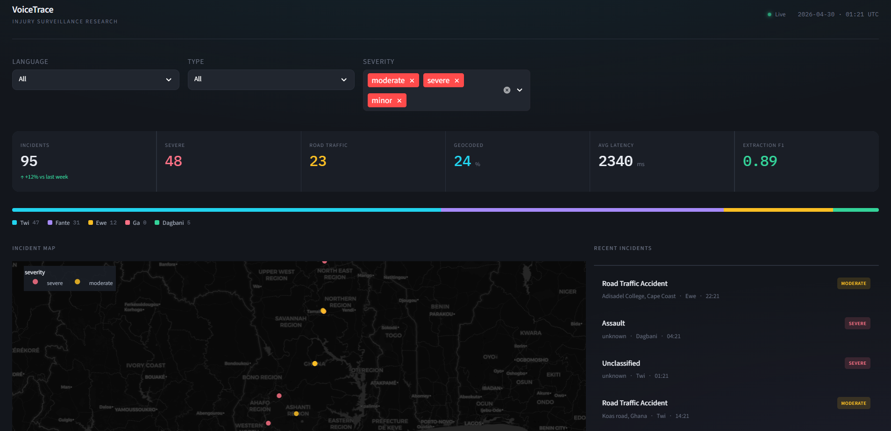

# VoiceTrace

**Multilingual Voice-Based Injury Reporting and Surveillance for Ghana**

[](https://www.python.org/downloads/)
[](https://opensource.org/licenses/MIT)
[](https://voice-trace.streamlit.app/)

VoiceTrace is a five-stage NLP pipeline that accepts a spoken injury report in any of five Ghanaian languages and produces two outputs from the same call:
1. A spoken first-aid response in the caller's language
2. A structured, geocoded record for health surveillance



**[View Live Dashboard](https://voice-trace.streamlit.app/)**

## Table of Contents

- [Dashboard](#dashboard)
- [Installation](#installation)
- [Quick Start](#quick-start)
- [Project Structure](#project-structure)
- [Configuration](#configuration)
- [Data](#data)
- [Evaluation](#evaluation)
- [Reproduction](#reproduction)
- [Citation](#citation)
- [License](#license)

## Dashboard

The surveillance dashboard is live at **[voice-trace.streamlit.app](https://voice-trace.streamlit.app/)**

Features:
- Real-time incident map with severity-coded markers
- Language distribution visualization
- Incident feed with filtering by type, language, and severity
- Facility referral tracking
- First aid guidance display

To run locally:

```bash
streamlit run dashboard/app.py
```

## Installation

### Prerequisites

- Python 3.10 or higher
- API keys:
  - `KHAYA_API_KEY` - for Khaya ASR/MT/TTS ([GhanaNLP](https://ghananlp.org))
  - `ANTHROPIC_API_KEY` - for Claude extraction ([Anthropic](https://anthropic.com))

### Setup

```bash
# Clone the repository
git clone https://github.com/yoadjei/voice-trace.git
cd voicetrace

# Create virtual environment
python -m venv .venv
source .venv/bin/activate  # On Windows: .venv\Scripts\activate

# Install dependencies
pip install -r requirements.txt

# Configure environment
cp configs/env.example .env
# Edit .env to add your API keys
```

## Quick Start

### Run the Full Pipeline on Audio

```python
from pipeline.pipeline import run_pipeline

# Process a single audio file
result = run_pipeline("path/to/audio.wav")

print(result)
# {
#     "asr_transcript": "...",      # Twi transcript
#     "translated_text": "...",     # English translation
#     "injury_type": "rta",
#     "severity": "moderate",
#     "body_region": "lower_limb",
#     "victim_sex": "male",
#     "victim_age_group": "adult",
#     "location_description": "Near Kejetia market",
#     "lat": 6.6885,
#     "lng": -1.6244
# }
```

### Run Evaluation

```bash
# Full evaluation (all three tracks)
python scripts/run_full_evaluation.py

# Specific track
python scripts/run_full_evaluation.py --track 1  # ASR evaluation
python scripts/run_full_evaluation.py --track 2  # Translation fidelity
python scripts/run_full_evaluation.py --track 3  # Cross-language consistency
```

## Project Structure

```
voicetrace/
├── configs/                 # Configuration files
│   └── default.yaml        # Main config (seeds, paths, parameters)
├── data/
│   ├── distributions/      # Epidemiological sampling distributions
│   ├── raw/               # Raw external data (gitignored)
│   └── synthetic/         # Generated evaluation corpus
├── data_gen/              # Corpus generation scripts
├── evaluation/            # Evaluation scripts
├── paper/                 # LaTeX paper and figures
├── pipeline/              # Core VoiceTrace pipeline
│   ├── asr.py            # Stage 1: Speech recognition
│   ├── translate.py      # Stage 2: Translation
│   ├── extract.py        # Stage 3: LLM extraction
│   └── geocode.py        # Stage 5: Geocoding
├── results/               # Evaluation outputs
│   └── evaluation/       # Track 1-3 results
├── scripts/              # Entry point scripts
│   ├── run_full_evaluation.py
│   └── generate_corpus.py
├── src/                  # Shared utilities
│   └── config.py        # Configuration loader
└── tests/               # Unit tests
```

## Configuration

All parameters are centralized in `configs/default.yaml`:

```yaml
seeds:
  numpy: 42
  python: 42

languages:
  evaluated: [twi, fante, ewe, ga, dagbani]

api:
  anthropic:
    model: "claude-sonnet-4-6"
    temperature: 0.2

corpus:
  num_narratives: 126
  eval_subset_size: 80
```

## Data

### Synthetic Evaluation Corpus

The evaluation corpus consists of 126 injury narratives:
- Sampled from Ghana-specific epidemiological distributions
- Translated to 5 languages via Khaya MT
- Synthesized to audio via Khaya TTS

**Key files:**
- `data/synthetic/narratives_en.csv` - English source narratives
- `data/synthetic/narratives_{lang}.csv` - Translated narratives
- `data/synthetic/gold_annotations.csv` - Expert annotations
- `data/synthetic/audio/{lang}/` - TTS audio (gitignored)

### Generating the Corpus

```bash
# Generate English narratives (requires ANTHROPIC_API_KEY)
python scripts/generate_corpus.py --step narratives

# Translate to all languages (requires KHAYA_API_KEY)
python scripts/generate_corpus.py --step translate --all

# Synthesize audio
python scripts/generate_corpus.py --step tts --all
```

## Evaluation

### Track 1: End-to-End Pipeline (ASR → MT → Extract)

Measures Word Error Rate (WER) and post-ASR extraction F1.

```bash
python -m evaluation.evaluate_asr --all
python -m evaluation.evaluate_extraction --all
```

### Track 2: Translation Round-Trip Fidelity

Measures BERTScore and BLEU for translation quality.

```bash
python -m evaluation.evaluate_translation
python -m evaluation.run_extraction_all_langs
```

### Track 3: Cross-Language Consistency

Measures Cohen's κ across language pairs.

```bash
python -m evaluation.evaluate_consistency
```

## Reproduction

### Complete Reproduction Steps

```bash
# 1. Setup environment
python -m venv .venv && source .venv/bin/activate
pip install -r requirements.txt

# 2. Configure API keys
cp configs/env.example .env
# Edit .env with your keys

# 3. Generate corpus (or use provided data)
python scripts/generate_corpus.py --all

# 4. Run evaluation
python scripts/run_full_evaluation.py

# 5. Generate paper figures
python paper/generate_figures.py
```

### Expected Results (from paper)

| Language | Track 2 Macro-F1 | Track 2 κ | Track 1 WER |
|----------|------------------|-----------|-------------|
| Twi      | 0.66            | 0.80      | 51.4%       |
| Fante    | 0.55            | 0.52      | 61.0%       |
| Ewe      | 0.23            | 0.13      | 56.1%       |
| Ga       | 0.19            | 0.09      | 80.9%       |
| Dagbani  | 0.17            | 0.08      | 54.1%       |

### Reproducibility Notes

- **Random seeds**: Set in `configs/default.yaml` (numpy=42, python=42)
- **Claude API**: Uses temperature=0.2 for low variance; exact reproducibility not guaranteed
- **Khaya API**: Deterministic for same input
- **Evaluation subset**: Fixed 80 narrative IDs in `data/synthetic/evaluation_subset_ids.txt`

### Hardware

- Experiments run on standard CPU (no GPU required)
- Estimated reproduction time: ~2 hours for full evaluation
- Storage: ~500MB for corpus with audio

## Citation

```bibtex
@inproceedings{adjei2026voicetrace,
  title={One Call, Two Outputs: Multilingual Voice-Based Injury 
         Reporting and Surveillance in Ghana},
  author={Adjei, Yaw Osei and Opoku, Davis and Owusu, Kwadwo Amanqua 
          and Partey, Benjamin Tei},
  booktitle={Proceedings of the Conference on Injury Prevention 
             and Research},
  year={2026}
}
```

## License

This project is licensed under the MIT License - see the [LICENSE](LICENSE) file for details.

## Acknowledgements

- [GhanaNLP](https://ghananlp.org) for the Khaya API
- [Anthropic](https://anthropic.com) for Claude API access
- KNUST Centre for Injury Prevention and Research
